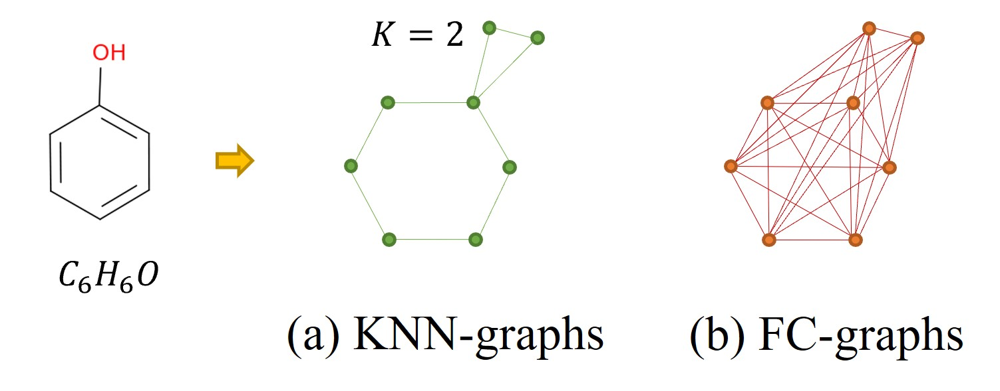

# 🔥Representation Bottleneck of Graph Neural Networks (GNNs) 
This is the official code for <span style="color:yellow">**Discovering the Representation Bottleneck of Graph Neural Networks from Multi-order Interactions**</span>.
[[arXiv](https://arxiv.org/abs/2205.07266)].  
Unlike social networks or knowledge graphs, no edges are explicitly defined for molecular 
graphs in the 3D Euclidean space, and researchers usually employ <span style="color:orange">**KNN-graphs**</span> and 
<span style="color:orange">**fully-connected graphs**</span> to construction the connectivity between 
nodes or entities (*e.g.*, atoms or residues). Our work reveals that these two standard graph construction methods can bring improper inductive bias,
which prevents GNNs from <span style="color:red">**learning interactions of the optimal order**</span> [[1]](#1) (*i.e.*, complexity) and therefore reduce their performance. To overcome this limitation, we design a new graph rewiring approach to dynamically adjust the receptive fields of each node or entity.    
<p align="center"></p>

## Environment
Some necessary packages before running the code. 
```markdown
pip install torch
pip install sklearn
pip install einops
pip install matplotlib
pip install torch-scatter torch-sparse torch-cluster torch-spline-conv torch-geometric -f https://data.pyg.org/whl/torch-{your!torch!version}+cu{your!cuda!version}.html
```

## Data
We examine the characteristics of GNNs on four different tasks. Among them, <span style="color:green">**Newtonian Dynamics**</span> and 
<span style="color:green">**molecular dynamics (MD)**</span> simulations are node-level
regression tasks, while <span style="color:green">**Hamiltonian dynamics**</span> and <span style="color:green">**molecular property prediction**</span>
are graph-level regression task. Please follow the following guidance 
to generate and preprocess the data. 
### Newtonian Dynamics & Hamiltonian Dynamics 
There we follow Cranmer et al. (2020) [[2]](#2) and adjust their [code](https://github.com/MilesCranmer/symbolic_deep_learning) to generate the data.

```markdown
# install necessary packages
pip install celluloid
pip install jax[cuda11_cudnn805] -f https://storage.googleapis.com/jax-releases/jax_releases.htmlpip install celluloid
pip install jaxlib
```
Note that `jax.ops.index_update` is deprecated at `jax` 0.2.22, and we modify the profile via `x0.at[].set()`. Moreover, it might
cause a problem with loading jax due to `Couldn't invoke ptxas`. This is because the path of `ptxas` is not available to the system.
 A possible solution is to install cuda manually using the `install_cuda_11_1.sh` file.  
Then run the following `sh` command to produce the raw data.
```markdown
sudo bash install_cuda_11_1.sh
```
Finally, preprocess the raw data and save as `pt` file for future usage. 
```python
python data/dataset_nbody.py
```

### Molecular Dynamics 
The MD dataset, ISO 17, is provided by the Quantum Machine organization, which is available in 
[its official website](http://quantum-machine.org/datasets/). After downloading the source data, run the following script to preprocess it.
```python
python data/dataset_iso17.py
```

### Molecular Property Prediction 
QM7 and QM8 datasets are also accessible in the same [link](http://quantum-machine.org/datasets/) of the Quantum Machine organization as the MD datatset. 
```python
python data/dataset_qm.py
```


## Analyze the Bottleneck of GNNs
### Train a Model 
Implement the following command to pre-train a 3D GNN model. 
```markdown
python train.py --data=qm7 --method=egnn --gpu=0,1 
```
### Calculate the Strength of GNNs
```markdown
# load a pretrained model
python test.py --data=qm7 --method=egnn --pretrain=1

# randomly initializing a model
python test.py --data=qm7 --method=egnn --pretrain=0
```

## Analyze the Bottleneck of CNNs
In Section <span style="color:purple">**Revisiting Representation Bottlenecks of DNNs**</span>, we additionally investigate the representation bottleneck of 
another commonly used type of DNNs, *i.e.*, CNNs. The <span style="color:orange">**cnn**</span> folder documents the corresponding implementation, which 
evaluates multi-order interaction strengths of [timm](https://github.com/rwightman/pytorch-image-models)
backbones for <span style="color:red">**visual representation learning**</span>. It is based on Deng et al. [[1]](#1) and their official 
[code](https://github.com/nebularaid2000/bottleneck).
### Environment 
This <span style="color:orange">**cnn**</span> repository works with **PyTorch 1.8** or higher and **timm**. There are installation steps with the latest PyTorch:
```shell
conda create -n bottleneck python=3.8 pytorch=1.12 cudatoolkit=11.3 torchvision -c pytorch -y
conda activate bottleneck
pip install -r cnn/requirements.txt
```
Then, please download datasets and place them under `./cnn/datasets`. [CIFAR-10](https://www.cs.toronto.edu/~kriz/cifar.html) will be automatically 
downloaded, while [ImageNet](http://www.image-net.org/challenges/LSVRC/2012/) should be downloaded and unziped manually.

### Calculate the Strength of CNNs
We only support the evaluation of pre-trained models. Please download released pre-trained models from [timm](https://github.com/rwightman/pytorch-image-models) 
and place them in `./cnn/timm_hub`. Then run the following example on ImageNet in `./cnn/interaction_in1k.sh`:
```
cd cnn 
bash interaction.sh
```
You can uncomment the setting, including the model name and ckeckpoints, that you want to run on top of the script. 
The results will be saved in the `results` directory by default.


## Cite and Contact
If you have any questions, please do not hesitate to contact <span style="color:yellow">**[Fang WU](mailto:fw2359@columbia.edu)**</span>.  
Please consider citing our paper if you find it helpful. Thank you! 😜
```markdown
@article{wu2022discovering,
  title={Discovering the Representation Bottleneck of Graph Neural Networks from Multi-order Interactions},
  author={Wu, Fang and Li, Siyuan and Wu, Lirong and Li, Stan Z and Radev, Dragomir and Zhang, Qiang},
  journal={arXiv preprint arXiv:2205.07266},
  year={2022}
}
```


## References
<a id="1">[1]</a> 
Deng, H., Ren, Q., Chen, X., Zhang, H., Ren, J., & Zhang, Q. (2021). Discovering and explaining the representation bottleneck of dnns. arXiv preprint arXiv:2111.06236.   
<a id="1">[2]</a> 
Cranmer, Miles, et al. "Discovering symbolic models from deep learning with inductive biases." NIPS 33 (2020): 17429-17442.


